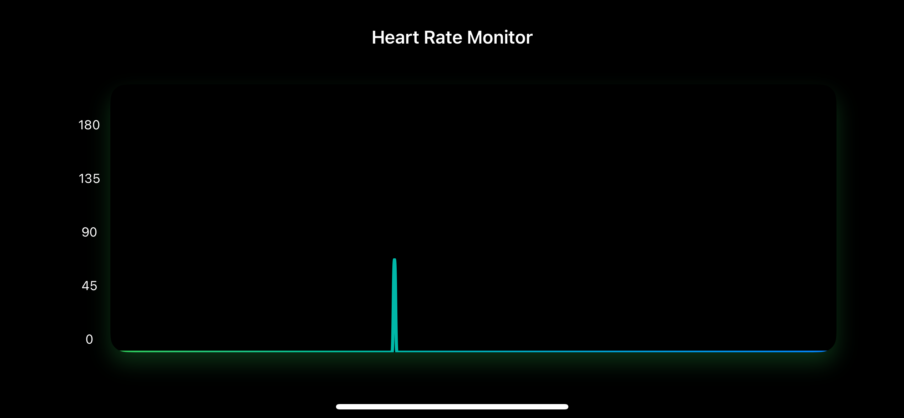

# HeartRateTracker

## 설명
애플워치로부터 심박수를 측정한 값을 모니터링할 수 있는 서비스입니다.

<div align="center">
  
</div>

## 심박수 전송
애플워치에서 iOS로 심박수 전송하기 위한 코드입니다.
```swift
func sendHeartRate(heartRate: Int, date: Date) {
    if WCSessionActivationState.activated == .activated {
        do {
            try session.updateApplicationContext(["HR":heartRate, "date":date])
        } catch {
            print("HR 전송실패")
        }
    }
}
```

## 심박수 수신
애플워치로부터 심박수를 받는 코드입니다.

```swift
func session(_ session: WCSession, didReceiveApplicationContext applicationContext: [String : Any]) {
  let hr = applicationContext["HR"] as! Int
  let date = applicationContext["date"] as! Date
  maintainHR()
  currentRate = HeartRate(hr: hr, date: date)
}
```
